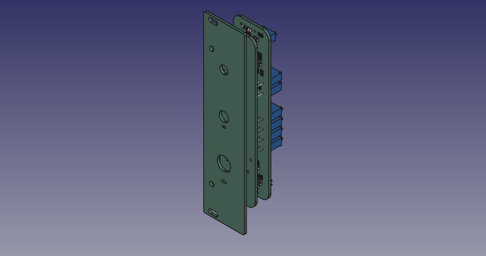
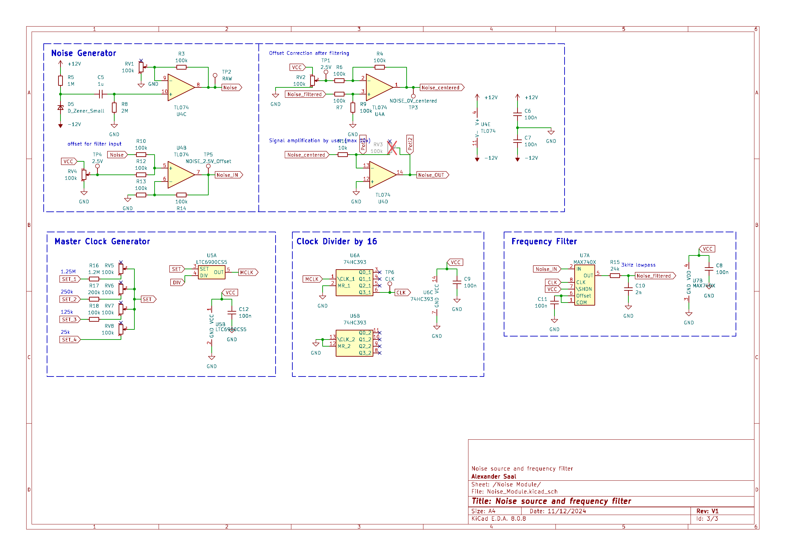
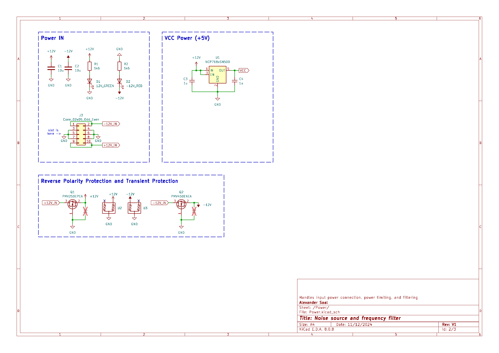

# Analog_Computer_Noise_Module
A frequency selectable Noise Module in a rack format for analog computing.

## Module Schematic

The noise is taken from a Zener diode, then slightly amplified and DC shifted to be feed into a low pass filter. The cutoff frequency can be selected with a rotary switch, which operates an adjustable oscillator. The signal is DC offset corrected after the filter and then amplified.

<ins> Noise: </ins>\

This module is largely based on [Bernd Ulmanns design and his archive in the Analogmuseum](https://analogmuseum.org/english/homebrew/noise_filter/) (last visited Dec. 2024). It even has the same frequency steps of: 1, 5, 10, 50, 100, 500 and 1000 $Hz$.

The Noise source is based on a Zener diode, following an article of [Steve Hageman on EDN, with the title: White noise source flat from 1Hz to 100kHz](https://www.edn.com/white-noise-source-flat-from-1hz-to-100khz/) (last visited Dec. 2024).

## Issues

The linear power regulator NCP718xSN500 (U1) overheats within seconds. Although it can handle the current, I did not account for the dissipated power. For a $12\,V$ input, the power dissipation is approximately $0.5\,W$, which immediately triggers a thermal shutdown. This failure cascades through the system, shutting down all components on the $+5V$ rail. 

More problematic is the ripple introduced around the diode used as the noise source. It causes slight variations in the single-digit $mV$ range, which pass through the high-pass filter and amplifier, leading to a significant offset voltage after the first stage. The voltage measured at test point $TP2$ is already outside of specifications.

For now, the recommended solution is to either cool or replace the linear power regulator.

## List of special Components:

- frequency filter :[MAX7407](https://www.digikey.de/en/products/detail/analog-devices-inc-maxim-integrated/MAX7407ESA/1513411)
- oscillator: [LTC6900](https://www.digikey.de/en/products/detail/analog-devices-inc/LTC6900CS5-TRMPBF/1115937)
- Rotary switch, 12 pole, 2 layers: [SWITCH ROTARY 2-12POS](https://www.digikey.de/en/products/detail/grayhill-inc/71BD30-02-1-AJN/98669)

## Bill of materials:

<ins> Main Noise Module: </ins>
|                                             |                     |           |          | 
|---------------------------------------------|---------------------|-----------|----------|
| References                                  | Value               | Footprint | Quantity | 
| C6, C7, C8, C9, C11, C12                    | 100n                | 1206/3216Metric | 6        | 
| C3, C4, C5                                  | 1u                  | 1206/3216Metric | 3        | 
| C1, C2                                      | 10u                 | 1206/3216Metric | 2        | 
| C10                                         | 2n                  | 1206/3216Metric | 1        | 
| R3, R4, R6, R7, R9, R10, R12, R13, R14, R18 | 100k                | 1206/3216Metric | 10       | 
| R1, R2                                      | 5k6                 | 1206/3216Metric | 2        | 
| R5                                          | 1M                  | 1206/3216Metric | 1        | 
| R8                                          | 2M                  | 1206/3216Metric | 1        | 
| R11                                         | 10k                 | 1206/3216Metric | 1        | 
| R15                                         | 24k                 | 1206/3216Metric | 1        | 
| R16                                         | 1.2M                | 1206/3216Metric | 1        | 
| R17                                         | 200k                | 1206/3216Metric | 1        | 
| D1                                          | GREEN Diode         | 1206/3216Metric | 1        | 
| D2                                          | RED Diode           | 1206/3216Metric | 1        | 
| D5                                          | Zener Diode         | any             | 1        | 
| U2, U3                                      | VCAN16A2-03S-E3-08  | SOT23-3         | 2        | 
| U1                                          | NCP718xSN500        | SOT-23-5        | 1        | 
| U4                                          | TL074               | SOIC-14         | 1        | 
| U5                                          | LTC6900             | TSOT-23-5       | 1        | 
| U6                                          | 74HC393             | SOIC-14         | 1        | 
| U7                                          | MAX740X             | SOIC-8          | 1        | 
| RV1, RV2, RV4, RV5, RV6, RV7, RV8           | 100k                | Potentiometer_Bourns_3296W_Vertical | 7        | 
| Q1                                          | PMV250EPEA          | SOT-23          | 1        | 
| Q2                                          | PMV450ENEA          | SOT-23          | 1        | 
| J1                                          | Conn_01x11_Pin      | | 1        | 
| J3                                          | Conn_02x05_Odd_Even | | 1        | 

<ins> Middleplate: </ins>
|              |                        |           |          | 
|--------------|------------------------|-----------|----------| 
| References   | Value                  | Footprint | Quantity | 
| Poti1, Poti2 | 100k Potentiometer     |           | 1        |
|              | SP12T switch, 2 layers |           | 1        |
|              | 2mm banana plug socket |           | 1        |

## License

This work is published under the [CERN Open Hardware Licence Version 2 - Strongly Reciprocal](LICENSE)